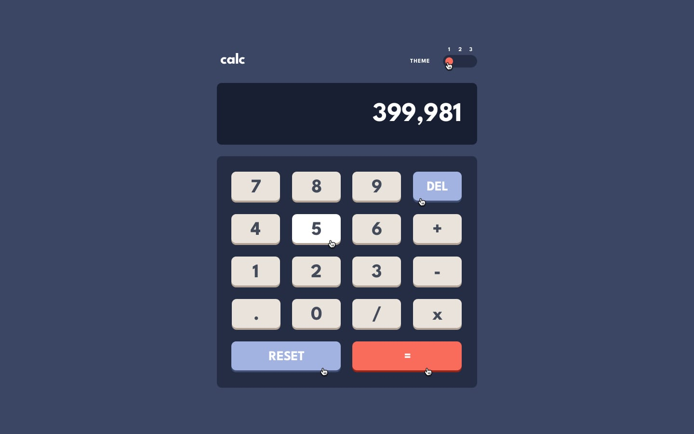

# Frontend Mentor - Calculator app

## Welcome! 👋

Vous devez reproduire ce design. Voici les détails (couleur, font-size,...):

### Backgrounds

- Navy 850 (main background): hsl(222, 26%, 31%)
- Navy 900 (toggle background, keypad background): hsl(223, 31%, 20%)
- Navy 950 (screen background): hsl(224, 36%, 15%)

### Keys

- Navy 700 (key background): hsl(225, 21%, 49%)
- Navy 800 (key shadow): hsl(224, 28%, 35%)

- Red 600 (key background, toggle): hsl(6, 63%, 50%)
- Red 800 (key shadow): hsl(6, 70%, 34%)

- Gray 200 (key background): hsl(0, 0%, 90%)
- Gray orange 400 (key shadow): hsl(28, 16%, 65%)

### Text

- Navy 750: hsl(221, 14%, 31%)
- White: hsl(0, 100%, 100%)

### Body Copy

- Font size (numbers): 32px

### Font

- Family: [League Spartan]
- Weights: 700
Le font est dans ce dossier, il vous faut l'intégrer dans le css.

### animations

N'oubliez la petite animation sur les radios buttons (1,2,3). N.B: propriété css "transition"
