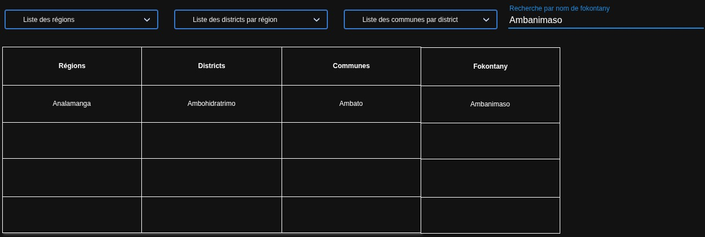

# Exercice : afficher les districts, communes et fokontany avec JavaScript

## Objectif

Créer une page `index.html` qui récupère les données du fichier `fokontany.json` avec `fetch`, puis affiche les informations de localisation au clic sur des boutons.

L'exercice permet de pratiquer :

- la récupération de données JSON avec `fetch`
- la manipulation de tableaux et d'objets en JavaScript
- l'affichage dynamique dans le DOM
- la gestion des événements avec `addEventListener`

<h1>On veut une belle interface svp!!!!!</h1>

## Fichiers à utiliser

Vous devez utiliser :

- `fokontany.json` : fichier contenant les données de localisation
- `index.html` : page HTML à créer

## Structure du fichier JSON

Le fichier `fokontany.json` contient un objet JavaScript organisé sur 4 niveaux :

1. les régions
2. les districts de chaque région
3. les communes de chaque district
4. les fokontany de chaque commune

La structure générale est la suivante :

```json
{
  "ANALAMANGA": {
    "Ambohidratrimo": {
      "Ambato": [
        {
          "commune": "Ambato",
          "region": "ANALAMANGA",
          "fokontany": "Ambanimaso",
          "district": "Ambohidratrimo"
        }
      ]
    }
  }
}
```

Attention : les noms des régions, districts et communes sont des clés d'objet.

## Travail demandé

Créer une page `index.html` qui contient :

1. Un titre principal.
2. Un `select` permettant de sélectionner une région.
3. Un `select` permettant de sélectionner un district.
4. Un `select` permettant de sélectionner une commune.
5. Une `table` pour afficher la liste des fokontany de la commune sélectionnée.
6. Du CSS pour rendre l'affichage plus lisible.
7. Un message d'erreur si le fichier JSON ne peut pas être chargé.
8. Un message indiquant que les données sont en cours de chargement.
9. Un champ de recherche par nom de fokontany.
10. Personnalisez chaque input, select avec du CSS.

## Fonctionnement attendu

### 1. Sélection d'une région et affichage des districts

Au chargement des données, remplir automatiquement le premier `select` avec la liste des régions.

L'utilisateur doit pouvoir :

1. choisir une région dans le `select`;
2. Charger la liste des districts de ce région dans le select liste des districts par région;

### 2. Sélection d'un district et affichage des communes

Le `select` des districts doit être rempli avec les districts disponibles par région.

L'utilisateur doit pouvoir :

1. Choisir un district dans le `select`;
2. Voir uniquement les communes du district sélectionné dans le select liste des communes;

### 3. Sélection d'une commune et affichage des fokontany

Le `select` des communes doit être rempli avec les communes disponibles par région ET district.

L'utilisateur doit pouvoir :

1. choisir une commune dans le `select`
2. Voir tous les fokontany de la commune sélectionnée dans la table;

N.B: Attention PAS DE DOUBLONS dans les select district, communes

### 4. Champ de recherche

- Un select pour lister toutes les régions;
- Un select pour lister les districts pour une région;
- un select pour lister les communes dans une district;
- Un zone de texte permettant de rechercher a partir du nom d'un fokontany;

Par exemple, si la liste des fokontany est affichée et que l'utilisateur tape `Ambato`, la table doit montrer uniquement les fokontany qui portent ce nom dans la table avec leurs région, district, commune dans les colonnes respectifs.



C'est juste une image pour représenter l'interface chacun est libre de créer une interface plus stylées.

## Contraintes techniques

- Utiliser obligatoirement `fetch` pour récupérer les données.
- Ne pas écrire les données directement dans le fichier HTML.
- Utiliser JavaScript pour créer ou modifier le contenu affiché dans la page.
- Utiliser un événement `change` sur les `select` si vous voulez mettre à jour les choix disponibles.
- Effacer l'ancien affichage avant d'afficher une nouvelle liste pour les select et pour la table.
- Le fichier principal de la page doit s'appeler `index.html`.
- Utiliser `Object.keys()` pour récupérer les régions, les districts et les communes.
- Utiliser la propriété `fokontany` pour récupérer le nom de chaque fokontany.
- Créer les éléments HTML avec `createElement`.

## Critères de validation

Suivez à la lettre les instructions.

Source data: https://github.com/julkwel/madagascar-map
