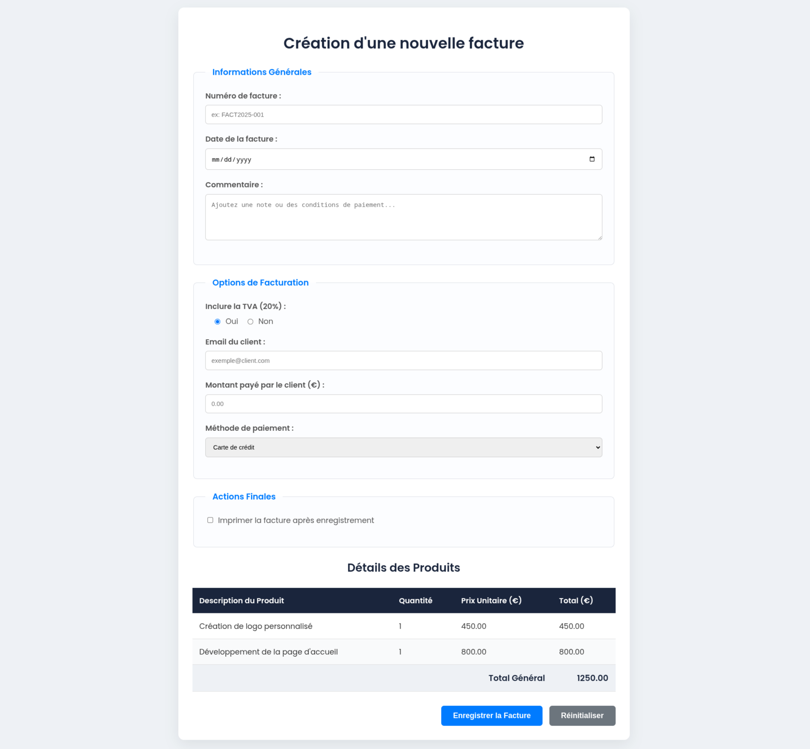

# TP11 - Créer un Formulaire de Facture

## Objectif

Créer un formulaire HTML complet et stylisé pour la gestion de factures, en maîtrisant les éléments de formulaire et leur mise en page CSS.

## Compétences ciblées

- Structurer un formulaire HTML avec `<form>`, `<fieldset>` et `<legend>`
- Utiliser différents types d'inputs : `text`, `date`, `email`, `number`, `radio`, `checkbox`
- Intégrer un `<textarea>` et un `<select>`
- Mettre en forme un formulaire avec CSS
- Créer une table HTML pour afficher les détails des produits
- Organiser la mise en page avec des conteneurs et des groupes de champs

---

## Consignes

### Partie 1 : Structure HTML

#### 1.1 - En-tête et conteneur principal

- Créez un document HTML5 valide avec `<!DOCTYPE html>`
- Ajoutez un titre de page : **Nouvelle Facture**
- Créez un conteneur principal avec la classe `invoice-container`

#### 1.2 - Formulaire : Section "Informations Générales"

Créez un premier `<fieldset>` avec la légende **"Informations Générales"** contenant :

- **Numéro de facture** : input `type="text"` avec placeholder "ex: FACT2025-001", attribut `required`
- **Date de la facture** : input `type="date"`, attribut `required`
- **Commentaire** : textarea avec 4 lignes, placeholder "Ajoutez une note ou des conditions de paiement..."

Chaque champ doit être enveloppé dans une `
` avec un `<label>` associé.

#### 1.3 - Formulaire : Section "Options de Facturation"

Créez un deuxième `<fieldset>` avec la légende **"Options de Facturation"** contenant :

- **Inclure la TVA (20%)** : deux `<input type="radio"` (Oui/Non) groupés dans une `
`
  - Oui sélectionné par défaut
  - Les deux options doivent partager le même attribut `name`
- **Email du client** : input `type="email"`, placeholder "exemple@client.com", `required`
- **Montant payé (€)** : input `type="number"` avec `min="0"`, `step="0.01"`, placeholder "0.00"
- **Méthode de paiement** : dropdown `<select>` avec options :
  - Carte de crédit
  - Virement bancaire
  - PayPal
  - Espèces

#### 1.4 - Formulaire : Section "Actions Finales"

Créez un troisième `<fieldset>` avec la légende **"Actions Finales"** contenant :

- Un `<input type="checkbox"` : "Imprimer la facture après enregistrement"

#### 1.5 - Tableau des produits

Après le formulaire, créez une table avec :

- **En-tête** : Description du Produit | Quantité | Prix Unitaire (€) | Total (€)
- **Corps** : deux lignes d'exemple
  - Ligne 1 : Création de logo personnalisé | 1 | 450.00 | 450.00
  - Ligne 2 : Développement de la page d'accueil | 1 | 800.00 | 800.00
- **Pied de table** : Ligne "Total Général" avec le montant 1250.00

---

### Partie 2 : Stylisation CSS

Créez un fichier `css/style.css` pour donner du styles afin d'avoir le design suivant:

## Résultat attendu

Un formulaire professionnel et bien organisé avec :
✓ Trois sections distinctes avec `<fieldset>`
✓ Tous les types d'inputs utilisés correctement
✓ Une mise en forme cohérente et lisible
✓ Une table bien présentée avec les détails des produits
✓ Une expérience utilisateur fluide avec des effets au focus

---

## Bonus (optionnel)

1. **Ajouter des boutons** : Créez un div `form-actions` avec des boutons "Enregistrer" et "Annuler"
2. **Validation JavaScript** : Ajoutez des validations côté client pour vérifier les champs (Ne pas faire si pas encore arrivé à la partie javascript)
3. **Responsive** : Adaptez le formulaire pour les écrans mobiles avec des media queries
4. **Calcul dynamique** : Créez un script qui calcule automatiquement le total avec TVA (Ne pas faire si pas encore arrivé à la partie javascript)

---

## Conseils

- Utilisez l'indentation pour bien structurer votre code HTML
- Testez votre formulaire dans le navigateur au fur et à mesure
- Vérifiez que tous les labels sont bien liés aux inputs via l'attribut `for`
- Utilisez des attributs `required` et `type` appropriés pour une meilleure validation
- Organisez votre CSS en sections commentées pour plus de clarté
