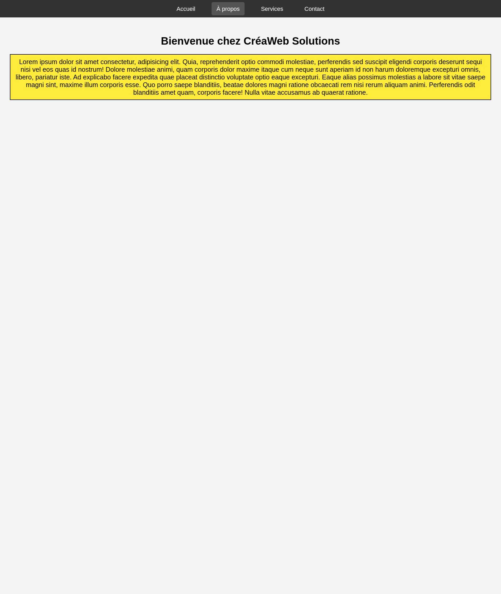

# TP5

Pratique pseudo-class hover, positionnement avec sticky, balise header et nav pour faire un menu de navigation, balise main pour le contenu principal.

## Ennoncé

Vous devriez reproduire le design correspondant à l'image ci-dessous.

### Animation menu

1. Supprime le soulignement des liens (Chaque menu doit être un lien href);
2. Ajoute une transition douce pour le survol;
3. Ajoute des bords arrondis au survol;
4. Affiche les éléments sur la même ligne;
5. Il faut bien espacer chaque menu comme dans l'image;

Voici l'image:

N.B: Faites un ctrl+shift+v pour visualiser dans visual code ce fichier
